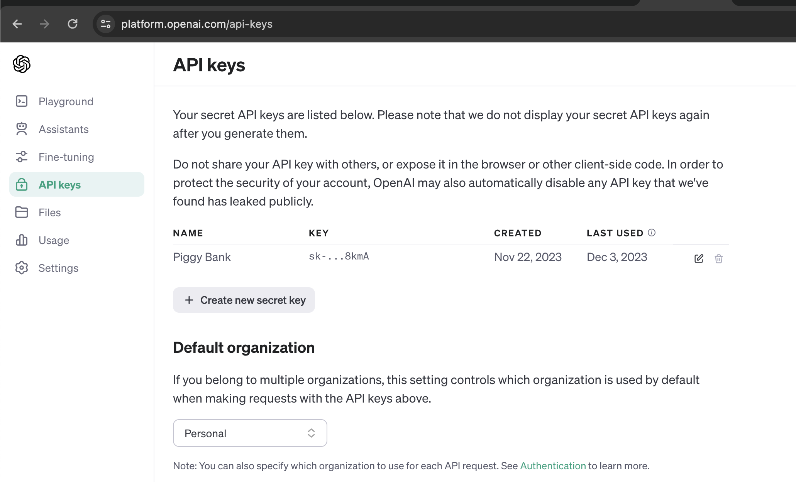
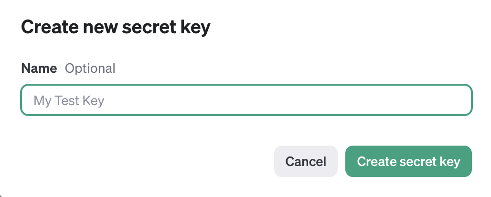
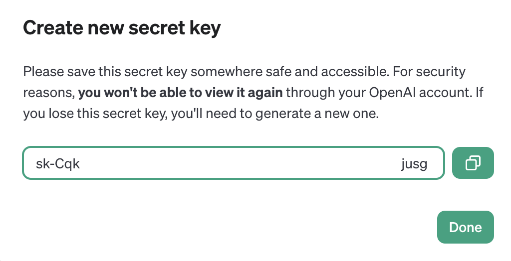
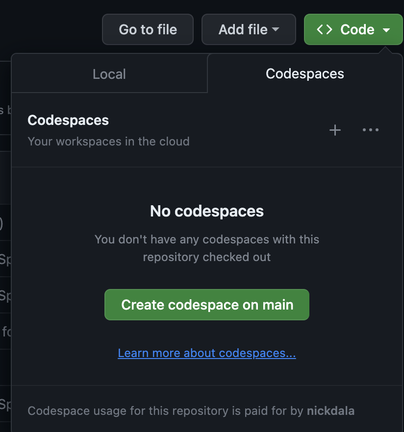
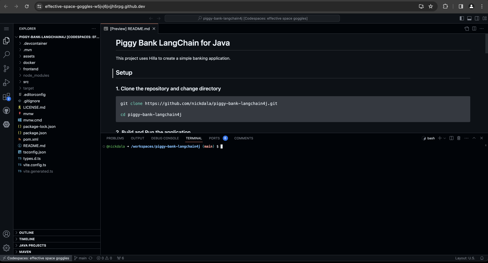
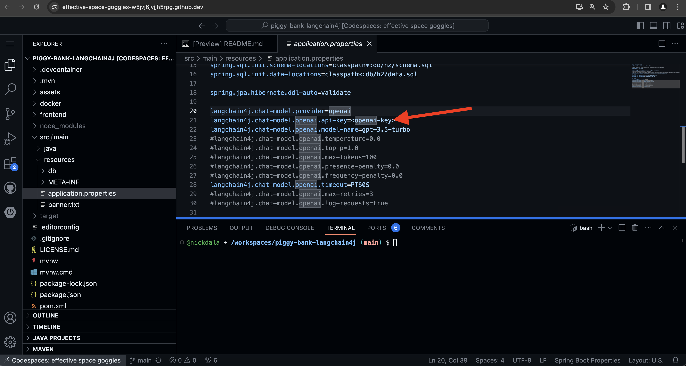
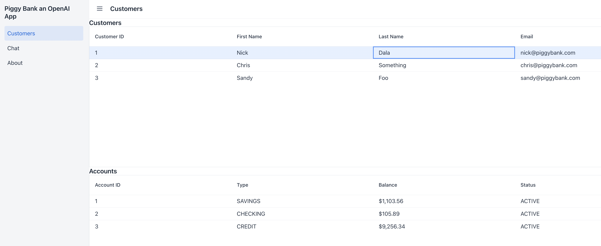
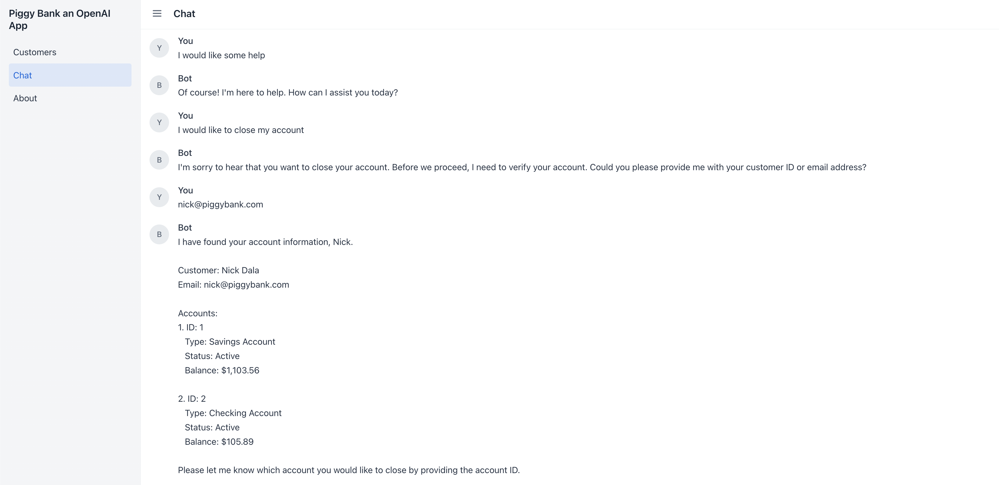

# Piggy Bank LangChain for Java

`Piggy Bank` is a simple AI driven banking application using [OpenAI](https://openai.com/), [LangChain4j](https://github.com/langchain4j/langchain4j) and [Spring Boot with React](https://hilla.dev/) :rocket:.

`Piggy Bank` is written in Java using [Hilla](https://hilla.dev/). The Hilla web framework was chosen because it brings together the power of Spring Boot and React. It allows you to build a full stack web application with a single codebase.

## Requirements

To keep things simple, the application covers the following use cases.

- A *Bank Associate* can see a list of customers
- A *Bank Associate* can click on a customer to see their accounts
- Accounts can either be *Opened* or *Closed*

Finally, we'll integrate **OpenAI's GPT-3 API** to allow a customer to close their account through an **AI driven chatbot**.

## Prerequisites

### Generate an OpenAI API Key

You will need to create an OpenAI API key to run the application. You can create a *secret API key* [here](https://platform.openai.com/api-keys).

1. Click on the `API keys` link.
    
1. Click on the `Create new secret key` button.
    
1. Give the secret key a name.
1. Click on the `Create secret key` button.
1. Copy the API key.
    

## Build & Deploy

The easiest way to build the sample is to use GitHub CodeSpaces. You can also use dev container to build the sample locally or use your own development environment.

To build the sample using CodeSpaces, follow the steps below.

1. Navigate to the GitHub repository [nickdala/piggy-bank-langchain4j](https://github.com/nickdala/piggy-bank-langchain4j)
1. Click on the `Code` button.
1. Click on the `Codespaces` tab.
1. Click on the `Create codespace on main` button.



This will create a GitHub Codespace and clone the repository. Once the Codespace is ready, you will see the following.



### Local Development (Optional)

You can also use your own development environment to run the application. Below are the requirements for your development environment according to [Hilla](https://hilla.dev/docs/react/start/basics#requirements).

- Java 17 or later
- Node 18 or later
- An IDE that supports Java and TypeScript — IntelliJ Ultimate and VS Code are good choices

To run the application locally, clone the repository and change directory

```bash
git clone https://github.com/nickdala/piggy-bank-langchain4j.git

cd piggy-bank-langchain4j
```

### Set the OpenAI API Key

Next, we need to set the OpenAI API key in the `application.properties` file. To do this, navigate to `src/main/resources/application.properties` and set the property `langchain4j.chat-model.openai.api-key`.



### Build and Run the application

To build and run the application, run the following command in the CodeSpaces terminal.

```bash
./mvnw
```

This will build and run the application. A new browser window will launch automatically with the **Piggy Bank** application.

Here is the UI of what the application looks like.



## Closing an account with an AI driven chatbot

To close an account, click on the `Chat` menu. This will launch an AI driven chatbot. The chatbot will ask you a series of questions to close the account.

Here is a sample conversation with the chatbot looks like.



Provide the chatbot with the id of the account you want to close. Once the account is closed, verify this in the UI.

Pretty cool, right? :sunglasses:

## Getting started with LangChain4j

Lets now take a look at how we incorporate [LangChain4j](https://github.com/langchain4j/langchain4j) into your application.

### Maven Dependency

The first step is to add the LangChain4j dependency to your `pom.xml` file of your Spring Boot application.

```xml
<dependency>
  <groupId>dev.langchain4j</groupId>
  <artifactId>langchain4j-spring-boot-starter</artifactId>
  <version>0.24.0</version>
</dependency>
```

### Include OpenAI API Key in application.properties

Next, we need to set the OpenAI API key in the `application.properties` file. To do this, navigate to `src/main/resources/application.properties` and set the property `langchain4j.chat-model.openai.api-key`.

```properties
langchain4j.chat-model.openai.api-key=<your-openai-api-key>
```

## Key Takeaways

By using LangChain4j, we were able to build an AI driven chatbot with just a few lines of code. This project contains the following AI features.

- Large Language Models (LLMs)
- Prompt Engineering
- LangChain4j Tools

### Prompts and Large Language Models (LLMs)

We were able to leverage the power of LLMs and Prompt Engineering to build a chatbot that can close an account.

Within the interface [CustomerSupportAgent](./src/main/java/dev/langchain4j/samples/piggybank/CustomerSupportAgent.java), we have the following `@SystemMessage`.

```java
public interface CustomerSupportAgent {
    @SystemMessage({
        """
            You are a customer support agent of a bank named 'Piggy Bank Assistant'.
            Ask the customer how you can help them. The only thing you can assist
            the customer with is closing an account.
```

The `@SystemMessage` annotation is used to define the prompt for the chatbot. The prompt is the first instruction to the LLM and is used to generate the response from the chatbot.

As an exercise, try changing the prompt and see how the chatbot responds.

### LangChain4j Agents & Tools

Agents are used to tell the LLM what actions to take. In chains, a sequence of actions is hardcoded. Agents, on the other hand, utilize a language model as a reasoning engine to determine which actions to take and in which order. Tools are used to help the LLM perform the actions. They are methods an agent can use to perform an action.

Within the class [AccountTools](./src/main/java/dev/langchain4j/samples/piggybank/AccountTools.java), we have the following `@Tool` annotation.

```java
public class AccountTools {
    @Tool("Close account by id")
    public boolean closeAccount(long accountId) {
        accountService.closeAccount(accountId);
        return true;
    }

    @Tool("Finds the customer by id")
    public CustomerRecord findCustomerById(long customerId) {
        return customerService.findCustomertById(customerId);
    }
}
```

The `@Tool` annotation is used to define the tool for the chatbot. It's important to provide a proper description of the tool. This will help the LLM determine which tool to use.

## Conclusion

In this article, we built an AI driven chatbot using LangChain4j. We were able to leverage the power of LLMs and Prompt Engineering to build a chatbot that can close an account.
